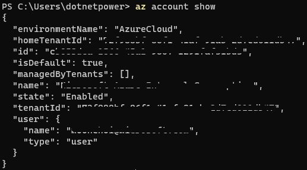

# Manage Azure Virtual Machine Using Powershell
az cli 와 파워쉘 스크립트를 이용한 VM 관리 예제 입니다. 향후 bash 쉘로 변경될 수 있으므로 Azure Powershell Module은 사용하지 않습니다.

## 사전 준비 사항
az cli 도구를 powershell 에서 사용하여 VM 이미지를 만들고, 이미지 갤러리에 등록하고, 등록된 이미지를 신규 VM 을 생성할 때 재 사용하기위해 다음 사전 준비사항이 필요합니다.

### az cli 도구 설치

[Install Azure CLI on Windows](https://learn.microsoft.com/en-us/cli/azure/install-azure-cli-windows?tabs=powershell#powershell)

관리자 권한으로 Powershell 을 실행 하고 아래 명령을 실행
```powershell
$ProgressPreference = 'SilentlyContinue'; Invoke-WebRequest -Uri https://aka.ms/installazurecliwindows -OutFile .\AzureCLI.msi; Start-Process msiexec.exe -Wait -ArgumentList '/I AzureCLI.msi /quiet'; Remove-Item .\AzureCLI.msi
```

### 이미 az cli 도구가 설치된 상태인 경우
*본 예제를 작성하는 시점의 az cli 의 버전은 2.46.0 입니다.*

버전 확인
```powershell
az --version
```

버전이 2.46.0 보다 낮은 경우
```powershell
az upgrade
```

### az cli 로그인 확인
다음 명령에서 현재 로그인 된 구독이 보이면 로그인 된 상태, `az login` 을 요구 하는 경우 `az login` 필요
```powershell
az account show
```


> 2023년 5월 부터 Windows 에서 az login 할 때 [Web Account Manager](https://learn.microsoft.com/ko-kr/windows/uwp/security/web-account-manager)가 기본 인증자로 설정되므로 다음처럼 미리 설정 필요.
```powershell
az config set core.allow_broker=true
az account clear
az login
```

### (선택) 특정 구독 선택
`az account show` 명령으로 원하는 구독이 아닌 다른 구독이 보이는 경우 구독 변경을 위해서 다음 절차 필요

```powershell
# 전체 구독 목록 표시
az account list --query "[].name"

# 해당 구독 이름 지정
az account set --subscription "구독이름"

# 지정된 구독 확인
az account show
```

여기까지 문제 없이 설정이 되었으면 VM 관련 예제를 확인해 볼 수 있습니다. 

## 예제
예제에 사용되는 환경 변수

```powershell
# 베이스 VM 을 위한 설정 (동일한 리소스그룹 이름이 존재 하는 경우 다른 이름으로 변경 필요!)

Write-Host "----- 리소스 그룹 생성 및 다른 예제에 필요한 변수 -----" -ForegroundColor Red -BackgroundColor Green
$basevm_location = "KoreaCentral"
$basevm_rgname = "basevm-rg-koc"
$gallery_rgname = "gallery-rg-koc"
$compute_rgname = "compute-rg-koc"

Write-Host "----- 베이스 VM 생성에 필요한 변수 -----" -ForegroundColor Red -BackgroundColor Green
$basevm_win_name = "mywinvm"
$basevm_linux_name = "mylinuxvm"

```

| 예제 | 설명 |
| --- | --- |
| [리소스 그룹 생성](resource-group/README.md) | 테스트를 위한 리소스 그룹 생성 |
| [VM 생성](virtual-machine/README.md) | 베이스 이미지를 위한 VM 생성 |
| [이미지 갤러리 생성](compute-gallery/README.md) | 베이스 이미지를 이용하여 사용자 지정 이미지 저장소, 정의, 버전 생성 |
| [Storage Account 생성](storage-account/README.md) | Custom Script와 chocolatey를 이용해 필요한 소프트웨어 설치를 위한 powershell 스크립트 저장소 용 |
| [커스텀 이미지로 VM 생성](virtual-machine-image/README.md) | 커스텀 이미지로 VM 생성 후, 필요한 소프트웨어 설치 자동화 |


## 🚀 Tip
az cli 전체 설명은 [설명서](https://learn.microsoft.com/ko-kr/cli/azure/)를 참고

### 도움말
```powershell
명령어의 도움말을 표시 하기 위해서는 `--help` 또는 `-h` 사용

# az cli 의 전체 도움말 표시
az --help

# help 줄임
az -h

# 계정에 대한 대표 도움말 표시
az account -h

# 계정 목록에 대한 도움말 표시
az account list -h
```

### 결과 쿼리
[JMESPath 쿼리](https://learn.microsoft.com/ko-kr/cli/azure/query-azure-cli?tabs=concepts%2Cpowershell)
```powershell
# 구독의 이름만 출력
az account list --query "[].name"

# 구독의 id와 이름을 출력(json)
az account list --query "[].[id, name]"

# 구독의 id와 이름을 테이블 형태로 출력
az account list --query "[].[id, name]" -o table

# name이 Moon 인 값만 선택
az account list --query "[?name == 'Moon']"

# isDefault 가 true 인 값만 선택
az account list --query "[?isDefault == ``true``]"

```